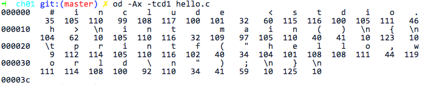

## 1.1 信息就是位+上下文  

hello程序的生命周期是从一个源程序开始的，而且这个源程序是一个文本文件。源程序都是由0和1组成的bit序列，而这些序列代表的文本字符都是通过ASCII标准来表示的。实际上就是用一个唯一的单字节大小的整数值来表示每个字符。  

我们通过OD打印hello.c的所有字符的ASCII码：   



Note:对二进制不熟悉的朋友，可以尝试下面的命令，看看它们之间的区别。

od -Ax -tco1 hello.c

od -Ax -tcx1 hello.c

od -Ad -tcd1 hello.c

od -Ao -tcd1 hello.c

系统中所有的信息———包括磁盘文件、存储器中的程序、存储器中存放的用户数据以及网络上传送的数据，都是由一串位表示的。区分不同数据对象的唯一方法是我们读到这些数据对象时的上下文。  

如果我们查看编译后的可执行文件：  

```bash
➜  ch01 git:(master) ✗ od -Ax -tx1 hello
000000 7f 45 4c 46 02 01 01 00 00 00 00 00 00 00 00 00
000010 02 00 3e 00 01 00 00 00 30 04 40 00 00 00 00 00
000020 40 00 00 00 00 00 00 00 d8 19 00 00 00 00 00 00
000030 00 00 00 00 40 00 38 00 09 00 40 00 1f 00 1c 00
000040 06 00 00 00 05 00 00 00 40 00 00 00 00 00 00 00
000050 40 00 40 00 00 00 00 00 40 00 40 00 00 00 00 00
000060 f8 01 00 00 00 00 00 00 f8 01 00 00 00 00 00 00
000070 08 00 00 00 00 00 00 00 03 00 00 00 04 00 00 00
000080 38 02 00 00 00 00 00 00 38 02 40 00 00 00 00 00 
```

也会发现所有的数据都是———串位。

从机器码层说明一下：
比如内存中的二进制信息  

	1000100111011000   

计算机可以把它当做数据处理也可以当作指令来执行  

	1000100111011000  ——> 89D8H(数据)      
	1000100111011000  ——> mov ax,bx(程序)

决定是指令还是数据的判断：传输总线的类型  

当然这里的数据和指令都属于前面说的位   


本节提到两个概念： 
- 字节序列  这个关于大端小端的概念以后详细解释  
- 关于整数和实数的存储  在后面会通过汇编来说明      

## 问题：
在C语言程序的起源中，谈到了C语言为什么会成功的，也提到了C语言的指针是造成困惑和程序错误的常见原因，请问，为什么？  

详细答案请阅读《C和指针》