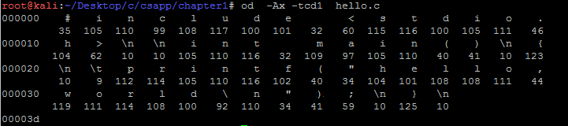

##1.1 信息就是位+上下文  

hello程序的生命周期是从一个源程序开始的，而且这个源程序是一个文本文件。源程序都是由0和1组成的bit序列，而这些序列代表的文本字符都是通过ASCII标准来表示的。实际上就是用一个唯一的单字节大小的整数值来表示每个字符。  

我们通过OD打印hello.c的所有字符的ASCII码：  

其实系统中所有的信息———包括磁盘文件、存储器中的程序、存储器中存放的用户数据以及网络上传送的数据，都是由一串位表示的。区分不同数据对象的唯一方法是我们读到这些数据对象时的上下文。  

如果我们查看编译后的可执行文件：  

	root@kali:~/Desktop/c/csapp/chapter1# od -Ax -tx1 hello
	001190 6c 5f 64 74 6f 72 73 5f 61 75 78 5f 66 69 6e 69
	0011a0 5f 61 72 72 61 79 5f 65 6e 74 72 79 00 66 72 61
	0011b0 6d 65 5f 64 75 6d 6d 79 00 5f 5f 66 72 61 6d 65
	0011c0 5f 64 75 6d 6d 79 5f 69 6e 69 74 5f 61 72 72 61
	0011d0 79 5f 65 6e 74 72 79 00 68 65 6c 6c 6f 2e 63 00
	0011e0 5f 5f 46 52 41 4d 45 5f 45 4e 44 5f 5f 00 5f 5f
	0011f0 4a 43 52 5f 45 4e 44 5f 5f 00 5f 5f 69 6e 69 74
	001200 5f 61 72 72 61 79 5f 65 6e 64 00 5f 44 59 4e 41

也会发现所有的数据都是一串位。

从机器码层说明一下:  
比如内存中的二进制信息  

	1000100111011000   

计算机可以把它当做数据处理也可以当作指令来执行  

	1000100111011000  ——> 89D8H(数据)      
	1000100111011000  ——>mov ax,bx(程序)

决定是指令还是数据的判断就是：传输总线的类型  

当然这里的数据和指令都属于前面说的位   

本节提到两个概念；  
字节序列这个关于大端小端的概念以后详细解释  
关于整数和实数的存储在后面会通过汇编来说明      

##问题：
在C语言程序的起源中，谈到了C语言为什么会成功的，也提到了C语言的指针是造成困惑和程序错误的常见原因，请问，为什么？  

详细答案请阅读《C和指针》