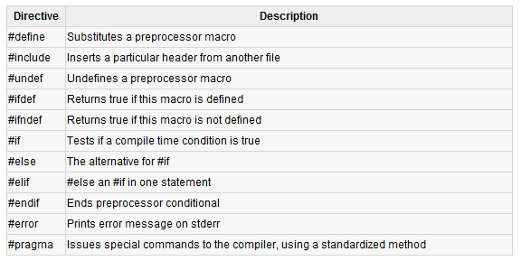

##1.2 程序被其他程序翻译成不同的格式 
 hello程序的生命周期是从高级C语言程序开始，然后为了在系统上运行该程序，须被其他程序转化为低级的机器语言指令，而存储程序的格式是二进制磁盘文件。  
        　　　　　　转化 　　　　　　　　　　　存储    
 源程序 ————————>机器语言————————>可执行文件  
　　　 (编译器编译)   　　　(指令)　　　文件系统(二进制)

现在在Linux系统下，我们梳理一下这个流程。

###1.预处理阶段
  预处理阶段，预处理器cpp会根据#开头的命令，修改原始的C程序。  
  例子：  
`root@kali:~/Desktop/c/csapp/chapter1# cpp hello.c -o hello.i`  
  查看生成的hello.i  

    1 # 1 "hello.c"
    2 # 1 "<command-line>"
    3 # 1 "hello.c"
    4 # 1 "/usr/include/stdio.h" 1 3 4
    5 # 27 "/usr/include/stdio.h" 3 4
     ......省略......
    842 extern void funlockfile (FILE *__stream) __attribute__ ((__nothrow__ , __lea    f__));
    843 # 943 "/usr/include/stdio.h" 3 4
    844
    845 # 2 "hello.c" 2
    846
    847 int main()
    848 {
    849  printf("hello,world\n");
    850 }

因为hello.c代码中只包括了文件包含命令，所以程序只把stdio.h的内容
插入到源程序中。  
下面我们会用更多的例子来说明预处理器做的工作。  
主要的预处理命令有：  

第一类：文件包含

文件包含包括#include <xxx.h>和#include "xxx.h"

#include <xxx.h> 表示被包含的文件在系统目录

#include "xxx.h"    表示被包含的文件在引号里面的目录，如果没路径则表示为当前目录。

对于自己写的头文件，适合用双引号，系统头文件两个都可用，但尖括号免去了在用户目录搜索。

在预处理阶段，预处理器把包含的头文件的内容展开到源文件中。

如果hello.c中去掉#include <stdio.h>

使用gcc编译提示信息：

    hello.c: In function 'main':
    hello.c:4:2: warning: incompatible implicit declaration of 
    built-in function 'printf' [enabled by default]

hello.i 中的内容就变成：

        1 # 1 "hello.c"
        2 # 1 "<command-line>"
        3 # 1 "hello.c"
        4
        5 int main()
        6 {
        7  printf("hello,world\n");
        8 }

编译出来的hello也可输出"hello,world"，为什么呢？ 
这是因为如果发现调用一个函数时并没有找到它的声明时，编译器会创建一个假的声明，这个声明使用你传递的参数并返回int。在这个例子中，因为printf()定义在libc.so中，在动态链接的时候会在默认的库文件libc.so中找到函数的定义。  

以下为hello加载的动态链接库

     root@kali:~/Desktop/c/csapp/chapter1# ldd hello
     linux-gate.so.1 (0xb77a1000)
     libc.so.6 => /lib/i386-linux-gnu/i686/cmov/libc.so.6 (0xb75d4000)
     /lib/ld-linux.so.2 (0xb77a2000)

如果不链接libc的话,则会报错：  

    root@kali:~/Desktop/c/csapp/chapter1# gcc -o hello  -nostdlib hello.c
    hello.c: In function 'main':
    hello.c:4:2: warning: incompatible implicit declaration of    
    built-in function 'printf' [enabled by default]
    /usr/bin/ld: warning: cannot find entry symbol _start; 
    defaulting to 00000000080480d8
    /tmp/cc5NiZBs.o: In function `main':
    hello.c:(.text+0x11): undefined reference to `puts'
    collect2: error: ld returned 1 exit status

这里提示找不到_start 和不能引用puts。
实际上，不链接libc，编译器不能够调用C库函数也不能得到C的引导代码。
_start函数是什么呢？Linux在启动时,它起了什么作用呢？怎么样重写该函数呢？跑题太远，这些在以后会讲到。

而puts则是编译器优化的结果，把printf替换为puts。
查看汇编：

      8 main:
      9 .LFB0:
      10         .cfi_startproc
      11         pushl   %ebp
      12         .cfi_def_cfa_offset 8
      13         .cfi_offset 5, -8
      14         movl    %esp, %ebp
      15         .cfi_def_cfa_register 5
      16         andl    $-16, %esp
      17         subl    $16, %esp
      18         movl    $.LC0, (%esp)
      19         call    puts     #编译器将printf优化为puts
      20         leave
      21         .cfi_restore 5
      22         .cfi_def_cfa 4, 4
      23         ret
      24         .cfi_endproc

这里只举例第一类，其他的预处理命令可以多试试，比较在生成代码中有什么不同。

###2.编译阶段
在编译阶段，编译器(ccl)会将文本文件hello.i翻译成文本文件hello.s,它包含一个汇编语言程序。这个是以后章节的重点，在这里就不多说了。

gcc在处理程序的流程：

gcc -S 就会生成汇编代码。

###3.汇编阶段
在汇编阶段，汇编器(as)将hello.s翻译成机器语言指令，打包到hello.o
这也是以后的重点，不多说。

    root@kali:~/Desktop/c/csapp/chapter1# as  -o hello.o hello.s
    root@kali:~/Desktop/c/csapp/chapter1# file hello.o
    hello.o: ELF 32-bit LSB relocatable, Intel 80386, version 1 (SYSV), not stripped

###4.链接阶段
链接器(ld)负责处理hello.o和调用函数的.o文件合并，得到可执行文件hello
这个也是重点，这次主要是讲预编译阶段。

    root@kali:~/Desktop/c/csapp/chapter1# ld -dynamic-linker /lib/ld-linux.so.2 -o hello -lc hello.o  
    ld: warning: cannot find entry symbol _start; defaulting to 00000000080481b0

##问题 
  Linux系统的启动过程是什么样的？
