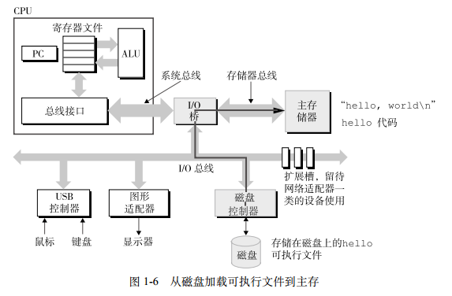
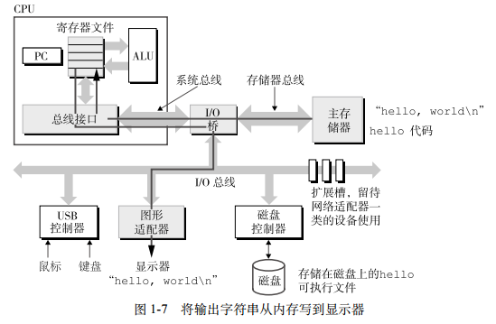

##1.4 处理器读并解释存储在存储器中的指令
###硬件
总线，I/O设备，主存，处理器等介绍略过。主要是下面的这个图：

###运行程序的流程

- 键盘 　 shell得到键盘的输入  

- shell　  shell执行指令将目标文件代码和数据从磁盘加载到内存  

- 处理器 　目标程序的机器语言代码复制到处理器执行，结果存储在寄存器中并复制到显示设备在屏幕显示  

##问题
shell加载程序的流程是什么？如何写一个简单的shell？  

