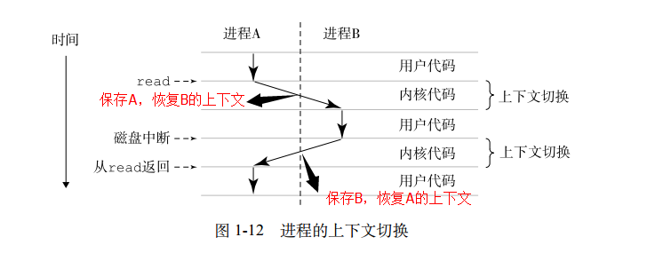
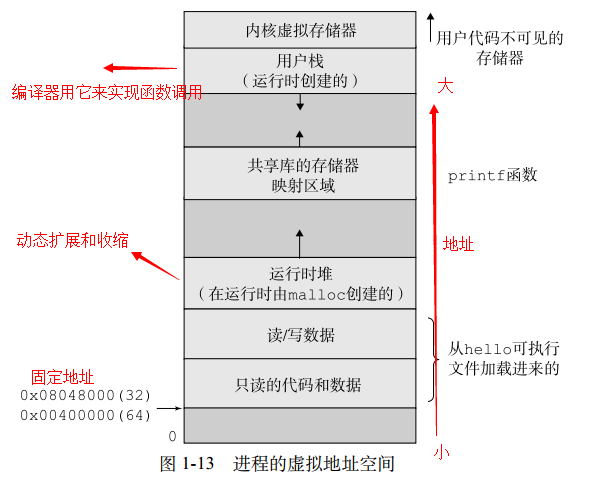

##1.7 操作系统管理硬件

###操作系统基本功能
- 防止硬件被失控的应用程序滥用
- 向应用程序提供简单一致的机制来控制复杂而又通常大相径庭的低级硬件设备

###进程
- 进程是操作系统对一个正在运行的程序的一种抽象。

关于上下文切换：   
上下文：操作系统保持跟踪进程运行所需的所以状态信息。例如：PC，寄存器，内存内容等    
上下文切换：当操作系统决定把控制权从当前进程转移到某个新进程时，就会进行上下文切换，保持当前进程的上下文，恢复新进程的上下文并将控制权转移给新进程。  
如下图所示：

 

进程的详细内容会在以后介绍。

###线程
一个进程实际上可以由多个线程执行单元组成，每个线程都是运行在进程的上下文中，并共享同样的代码和全局数据。  
书上提到网络服务器对并行处理的需求，线程成为越来越重要的编程模型，因为多线程之间比多进程之间更容易共享数据，也因为线程的一般来说都比进程更高效。  网络编程的模型，可以参考《UNP卷一》的总结和陈硕的这一篇博文——[多线程服务器的常用编程模型](http://blog.csdn.net/solstice/article/details/5307710)。  

线程以后会详细谈。  

###虚拟存储器
虚拟存储器是一个抽象概念，它为每个进程提供了一个假象，即每个进程都在独占地使用主存。每个进程看到的是一致的存储器，称为虚拟地址空间。  
以图说明：

 

- 程序代码和数据 
  对于所有的进程来说，代码是从同一固定地址开始，紧接着的是和C全局变量相对应的数据位置。  
  其实程序和数据都是有exec从程序文件中读入的。  
  它包括正文段，数据段和bss段。  
  - 正文段(.text段)：由CPU执行的机器执行部分，可共享，在存储器中只需要一个副本，只读。只读是为了防止程序修改自身的指令。 
 
  - 数据段(.data段)，也称初始化数据段。它包含了程序中需要明确赋值的变量。例如：初始化了的全局变量。  

  - bss段(.bss段)，也称未初始化段。在程序开始之前，内核将此段的数据初始化为0或者空指针，例如：未初始化的全局变量   
   
- 栈   
  自动变量和每次函数调用时所需要保持的信息都放在此段中。每次调用函数时，其返回地址以及调用者的环境信息都会存放在栈中，然后，最近被调用的函数在栈上为自动和临时变量分配空间。(递归函数调用自身的时候，会使用新的栈，所以变量不受影响)

- 堆  
  运行时堆。代码和数据区是在进程一开始运行时就被规定了大小，与此不同，当调用如malloc和free这样的C标准库函数时，堆可以在运行时动态地扩展和收缩。  

- 共享库  
  一块用来存放像C标准库和数学库这样共享库的代码和数据的区域。动态链接库的好处，以后详细说明。  

- 内核虚拟存储器  
  内核总是驻留在内存中，是操作系统的一部分。地址空间顶部的区域是为内核保留的，不允许应用程序读写这个区域的内容或者直接调用内核代码定义的函数。这个区域会存储命令行参数和环境变量。
   
最后，我们来看看hello的正文段，数据段和bss段的大小：

    root@kali:~/Desktop/c/csapp/chapter1# size hello
       text    data     bss     dec(十进制)     hex(十六进制)   filename
        328     176       0     504 (总长度)     1f8(总长度)     hello

hello程序不使用动态库编译之后大小：

    root@kali:~/Desktop/c/csapp/chapter1# gcc -static hello.c
    root@kali:~/Desktop/c/csapp/chapter1# size a.out
       text    data     bss     dec     hex filename
     565988    4004    4988  574980   8c604 a.out

使用动态库编译之后大小：

    root@kali:~/Desktop/c/csapp/chapter1# gcc hello.c
    root@kali:~/Desktop/c/csapp/chapter1# size a.out
       text    data     bss     dec     hex filename
       1150     288       4    1442     5a2 a.out

###文件
文件就是字节序列。  
每个I/O设备，包括磁盘、键盘、显示器，甚至网络，都可以视为文件。系统中的所有输入输出都是通过使用一小组称为UnixI/O的系统函数调用读写文件来实现的。

有兴趣的研究一下linux下的/proc文件夹。

##问题
编写一个使用epoll(ET模式)+Linux多线程的服务器程序，谈谈ET和LT的区别。