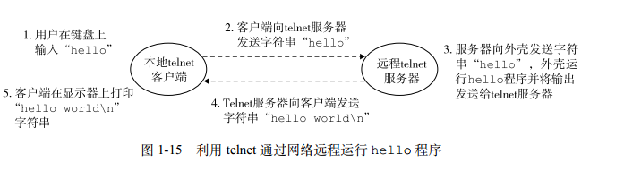

##1.8 系统之间利用网络通信
我们可以认为网络也是一种I/O设备。  
使用telnet在远程机器上运行hello流程图如下：

 

当我们在telnet客户端键入“hello”字符串并敲下回车键后，客户端软件就会将这个字符
串发送到telnet的服务器。telnet服务器从网络上接收到这个字符串后，会把它传递给远端外壳程序。接下来，远端外壳运行hello程序，并将输出行返回给telnet服务器。最后，telnet服务器通过网络把输出串转发给telnet客户端，客户端就将输出串输出到我们的本地终端上。  
这是典型的C/S程序交互的过程。  

书中并没有telnet的连接过程，这里介绍一下。  
telnet协议是应用层协议，用于远程登录。    
它使用TCP协议来连接远程主机，本地终端输入的字符全部以NVT格式明文传送，然后远程主机的输出也会以NVT格式传输并转化为本地格式，显示在本地终端上。    

对TCP协议不熟悉的可以看看《TCP/IP卷一》并用tcpdump抓包分析分析。

##问题
写一个简单的telnet程序，对程序的效率和安全性进行评估，并尝试修改程序。
